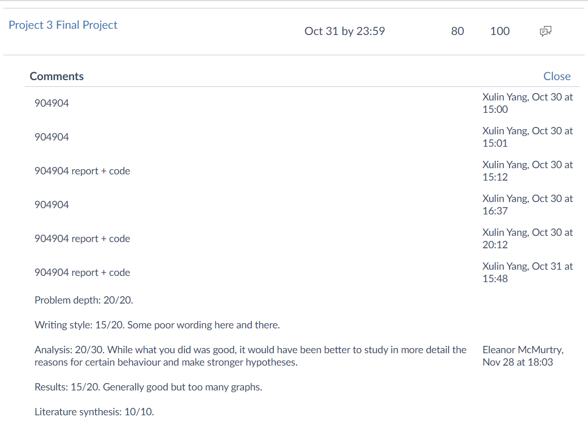
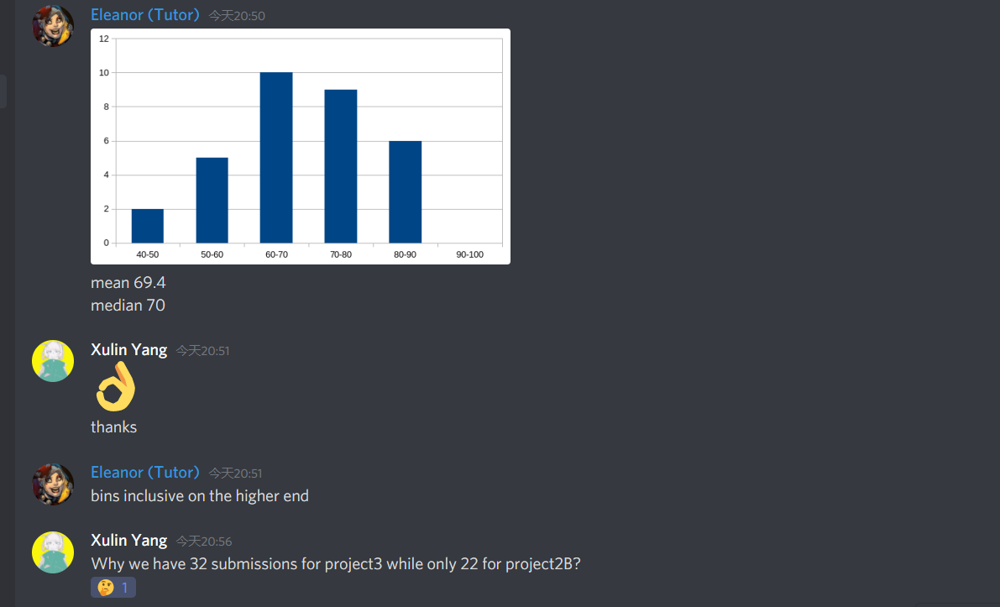

# N-body-problem
COMP90025 - Parallel and Multicore Computing - 2020S2 - Assignment3

## To markers
- report: [``` docs/COMP90025_Assignment_03.pdf ```](docs/COMP90025_Assignment_03.pdf)
- proposed hybrid naive O(n^2) approach: [``` n2_hybrid/n2_hybrid.cpp ```](n2_hybrid/n2_hybrid.cpp)
- proposed hybrid Barnes-Hut O(n logn) algorithm: [``` nlogn_hybrid/nlogn_hybrid.cpp ```](nlogn_hybrid/nlogn_hybrid.cpp)

## directories
|Content|Description|
|---|---|
|``` docs/ ```|specification & report
|``` random_body.cpp ```|genrate random 3D body
|``` body_*.data ```|generated random body
|``` generate_slurm.py ```|generate slurm scripts to be run on Spartan
|``` draw.py ```|draw analysis diagrams
|``` *.png ```|drawed figure in the report
|||
|``` n2_hybrid/ ```|proposed hybrid O(n^2) algorithm
|``` n2_hybrid_profile/ ```|proposed hybrid O(n^2) algorithm's runtime profile
|``` n2_openmpi/ ```|parallel O(n^2) by pure OpenMPI
|``` n2_openmpi_profile/ ```|parallel O(n^2) by pure OpenMPI runtime profile
|``` n2_sequential/ ```|O(n^2) sequential
|||
|``` nlogn_hybrid/ ```|proposed hybrid O(n logn) algorithm
|``` nlogn_hybrid_profile/ ```|proposed hybrid O(n logn) algorithm's runtime profile
|``` nlogn_openmpi/ ```|parallel O(n logn) by pure OpenMPI
|``` nlogn_openmpi_profile/ ```|parallel O(n logn) by pure OpenMPI runtime profile
|``` nlogn_sequential/ ```|O(n logn) sequential

## How to run
- All files have instruction of how to run at the end of each file.
1. generate random bodies
2. ``` python generate_slurm.py ```
3. cd ```n2_*/``` or ```nlogn_*/``` and ```sbatch *.slurm``` slurm scripts
4. ``` python draw.py ```

## submit
- ``` sbatch xxx.slurm ```

## spartan
- ``` squeue -u xuliny ```
- ``` scancel -u xuliny ```
- ``` spartan-weather ```
- ``` showq -a snowy ```
- ``` squeue --partition snowy ```

## Marks
- 16 out of 20 (80%)
- |criteria|marks|comments
  |---|---|---|
  |Problem depth|20/20
  |Writing style|15/20|Some poor wording here and there.
  |Analysis|20/30|While what you did was good, it would have been better to study in more detail the reasons for certain behaviour and make stronger hypotheses.
  |Results|15/20|Generally good but too many graphs
  |Literature synthesis|10/10
- 

### feedback
- 
- 
- 